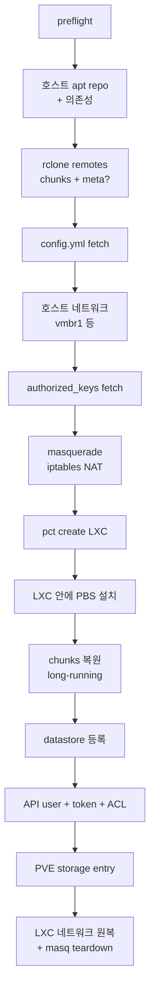

[English](README.md) | [한국어](README.ko.md)

# pbs-bootstrap

Proxmox Backup Server LXC 를 한 줄 명령으로 DR 해주는 스크립트. 베어메탈 PVE 설치 직후부터 "PVE GUI 에서 백업 browse 가능" 상태까지. repo clone, 환경변수 export, README 길게 읽기 — 다 필요 없음. 기본은 인터랙티브 TUI.

```
┌────────────────────────────────────────────┐
│  pbs-bootstrap                             │
├────────────────────────────────────────────┤
│                                            │
│   Storage backend                          │
│   ( ) Backblaze B2                         │
│   (*) S3-compatible                        │
│                                            │
│           < OK >    < Cancel >             │
└────────────────────────────────────────────┘
```

## 결과물


E 까지가 부트스트랩. VM 실제 복원은 운영자 영역.

## 전제조건

- **PVE 호스트** 베어메탈 설치 직후 상태. 설치 ceremony 에서 `vmbr0` 를 **공유기 / ISP 모뎀** 가리키게. 복구 대상인 LAN firewall VM 가리키면 안 됨.
- PVE GUI 브라우저 접근 (`https://<vmbr0-ip>:8006`). 웹쉘로 충분, 노트북 SSH 키 안 필요.
- **chunks bucket** 에 PBS datastore 정기 미러 (B2 native 또는 S3-compatible — AWS, MinIO, R2, Wasabi, B2 via S3 등).
- chunks bucket **read 권한** application key 2개. 홈랩 밖에 보관 (password manager, 암호화 USB).
- `bootstrap-config.yml` 과 `authorized_keys` 가 어딘가 있어야 함. 선택지:
  - GitHub repo (raw URL, private 면 PAT)
  - HTTPS URL
  - 같은 B2/S3 (**meta** bucket read 키 2개 추가)
  - 로컬 파일 (DR 중 paste 가능)
  - GitHub user `.keys` endpoint (SSH 키만)

이게 다. homelab repo / terraform / ansible 같은 거 부트스트랩 자체엔 안 필요 — 그것들은 부트스트랩의 상위 단계임.

## `bootstrap-config.yml` 스키마

```yaml
pbs:
  vmid:             200
  hostname:         pbs
  bridge:           vmbr1
  ip:               10.80.60.200
  gateway:          10.80.60.1
  datastore_name:   system-backup
  datastore_path:   /mnt/pbs_backup
  rootfs_size:      100              # GB
  rootfs_storage:   local            # PVE storage ID
  cores:            2
  memory_dedicated: 2048             # MB
  memory_swap:      1024             # MB

# vmbr0 *외에* 호스트에 만들 bridge.
# (vmbr0 는 PVE 설치 ceremony 가 이미 만듦)
# 비어있으면 이 단계 건너뜀.
host:
  bridges:
    - name:         vmbr1
      address:      10.80.60.254/24
      bridge_ports: none
      static_routes:
        - { subnet: 10.80.80.0/24, gateway: 10.80.60.1 }

storage:
  type:          b2                 # b2 | s3
  # endpoint:    https://...        # type=s3 일 때 필수
  # region:      us-east-005        # type=s3 일 때 필수
  chunks_bucket: my-pbs-chunks
```

## 파이프라인



시간: 프롬프트 ~1분 · 셋업 ~3분 · chunks 복원 ~10분~수 시간 (크기 / egress) · 마무리 ~30초.

## DR 절차

1. **PVE 베어메탈 설치.** hostname, vmbr0 IP/gw/DNS, root pw. rootfs 디스크 ≥ `pbs.rootfs_size + 30 GB`.
2. **PVE 웹쉘 열기**: `https://<vmbr0-ip>:8006` → 노드 → Shell.
3. **부트스트랩 실행**:
   ```bash
   bash <(curl -sSL https://raw.githubusercontent.com/bigpie1367/pbs-bootstrap/main/bootstrap.sh)
   ```
4. 프롬프트 응답 (chunks 키, config 위치, SSH 키 위치). 그 다음 파이프라인 자동.
5. **검증**:
   ```bash
   pvesm status -storage pbs       # → active
   ```
   PVE GUI: `Datacenter → Storage → pbs` → backup browse 가능 확인.

여기까지면 부트스트랩 끝. firewall VM 부터 복원 → 나머지 → steady-state 자동화 재가동 은 [부트스트랩 끝난 뒤](#부트스트랩-끝난-뒤) 참고.

## 비대화식 (CI / 자동화 / 재실행)

환경변수 다 채워두면 TUI 안 뜸:

```bash
export PBS_STORAGE_TYPE=b2                        # 또는 s3
# (s3 만)
# export PBS_STORAGE_ENDPOINT=https://s3.us-east-005.backblazeb2.com
# export PBS_STORAGE_REGION=us-east-005

export PBS_CHUNKS_KEY_ID=...  PBS_CHUNKS_KEY=...

export PBS_CONFIG=b2://my-pbs-meta/bootstrap-config.yml
export PBS_AUTH_KEYS=b2://my-pbs-meta/authorized_keys
# (PBS_CONFIG 또는 PBS_AUTH_KEYS 가 b2:// / s3:// 일 때만)
export PBS_META_KEY_ID=...    PBS_META_KEY=...

bash bootstrap.sh
```

일부만 export 해도 TUI 가 빠진 것만 물어봄.

### Source URI 형식

| 형태 | 사용처 | 비고 |
|---|---|---|
| `b2://<bucket>/<path>` | 둘 다 | meta 키 필요 |
| `s3://<bucket>/<path>` | 둘 다 | meta 키 필요 |
| `github:<owner>/<repo>/<branch>/<path>` | 둘 다 | private 이면 `PBS_<KIND>_GITHUB_PAT` |
| `https://...` | 둘 다 | raw HTTP fetch |
| `/abs/path` 또는 `./path` | 둘 다 | 로컬 파일 |
| `<word>` (단어) | auth_keys 만 | `https://github.com/<word>.keys` |
| `skip` | auth_keys 만 | SSH 키 안 박음 (웹쉘 전용) |

## 네트워크 shim — 왜, 어떻게

```mermaid
flowchart LR
    LXC["새 PBS LXC<br/>10.80.60.200"]
    Host["Proxmox 호스트<br/>vmbr1 10.80.60.254"]
    HostWAN["호스트 vmbr0<br/>192.168.0.115"]
    Router["공유기<br/>192.168.0.1"]
    Dead[("pfSense<br/>10.80.60.1 ❌")]
    B2[B2 / S3]

    LXC -.->|"평상시"| Dead
    LXC -->|"부트스트랩 중<br/>gw override"| Host
    Host -->|"iptables MASQUERADE"| HostWAN
    HostWAN --> Router
    Router --> B2

    style Dead fill:#3a1e1e,stroke:#8c5a5a
```



부트스트랩은 LAN firewall 살아있다고 가정 안 함. 매 실행:
- 호스트에 `ip_forward=1` (이전 값 저장).
- `iptables -t nat MASQUERADE` 룰을 LXC subnet 에 대해 `vmbr0` out 으로 추가.
- LXC 만들 때 gateway 를 호스트의 bridge IP 로, DNS 를 `1.1.1.1` 로 override.
- chunks 복원 끝나면 `pct set --net0` 으로 선언된 steady-state gateway 로 원복 + masquerade 룰 teardown.

전부 자동 — toggle env 없음.

## 트러블슈팅

<details><summary><b>chunks 복원 너무 느림</b></summary>

B2 의 class B (download) 트랜잭션 한도. Backblaze dashboard 확인. `lib/chunks-restore.sh` 의 `--transfers 16 --checkers 32` 가 일반 가정용 회선 기준. 대역폭 더 있으면 올려서 재시도.
</details>

<details><summary><b>부트스트랩 중 LXC 가 네트워크 없음</b></summary>

```bash
pct exec <vmid> -- ip -4 addr show
pct exec <vmid> -- ip -4 route show
pct exec <vmid> -- cat /etc/resolv.conf
```

흔한 원인: bridge 이름 안 맞음 (`bootstrap-config.yml` 의 `vmbr1` 가 호스트에 없음), MASQUERADE 룰 누락, DNS 안 잡힘.
</details>

<details><summary><b>LXC 안에서 `apt update` 실패</b></summary>

Debian 12 LXC 의 IPv6 default route 자주 깨짐. 스크립트가 `/etc/apt/apt.conf.d/99force-ipv4` 로 IPv4 강제. 그래도 실패 → LXC egress 자체가 문제, "네트워크 없음" 절로.
</details>

<details><summary><b>부트스트랩 끝났는데 datastore 안 보임</b></summary>

```bash
pct exec <vmid> -- journalctl -u proxmox-backup-proxy --no-pager -n 50
pct exec <vmid> -- ls -la /etc/proxmox-backup/
pct exec <vmid> -- ls -la <datastore-path> | head
```

흔한 원인: `datastore.cfg` 소유 잘못 (`root:backup` `0640`), datastore 경로 안 chunks 가 `root` 소유 — `chown -R backup:backup` 재실행.
</details>

<details><summary><b>PVE GUI 엔 backup 보이는데 `pvesm list pbs` 비어있음</b></summary>

PBS API 측 ACL/ownership. 수동 재부여:

```bash
pct exec <vmid> -- proxmox-backup-manager acl update \
    /datastore/<name> DatastoreAdmin --auth-id <user>@pbs
pct exec <vmid> -- proxmox-backup-manager acl update \
    /datastore/<name> DatastoreAdmin --auth-id '<user>@pbs!<token>'
```
</details>

<details><summary><b>`pveam download` 가 템플릿 못 찾음</b></summary>

기본 `PBS_TEMPLATE` 이 Proxmox 미러에서 더 새 minor 로 대체됐을 수 있음.

```bash
pveam update
pveam available --section system | grep debian-12-standard
```

`PBS_TEMPLATE=<새-이름> bash bootstrap.sh` 로 재실행.
</details>

<details><summary><b>LXC 이미 존재</b></summary>

부트스트랩은 same VMID 덮어쓰기 거부. 중간 실패 후:

```bash
pct stop <vmid> --force 2>/dev/null
pct destroy <vmid> --force
```

그 다음 재실행. Resume 모드는 없음.
</details>

## 부트스트랩 끝난 뒤

PVE 가 PBS 보는 시점에서 멈춤. 그 뒤는 운영자 영역:

- PBS GUI 직접 로그인 원하면 root pw — `pct exec <vmid> -- passwd root`.
- PVE GUI 에서 VM/CT 복원. 보통 LAN firewall 먼저 → 인프라 (secrets, 모니터링) → 앱 게스트들.
- Steady-state 자동화 재시동: 야간 B2 sync, prune / verify / GC, 알림, 모니터링.

이 분리가 의도적인 이유: 부트스트랩은 우리 홈랩과 완전 다른 셋업에서도 그대로 쓸 수 있게 두고, 복원 정책 / 일상 운영은 사용자 본인 repo 에 둠.

## License

MIT — [LICENSE](LICENSE) 참고.
