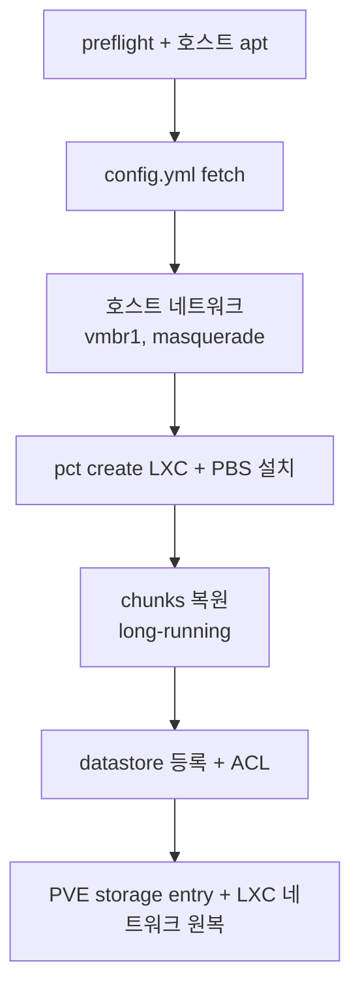

[English](README.md) | [한국어](README.ko.md)

# pbs-bootstrap

Proxmox Backup Server LXC 한 줄 DR: 베어메탈 PVE 설치 직후 → PVE GUI 에서 백업 browse 가능 상태. 기본은 인터랙티브 TUI, env var 로 자동화 가능.

## 빠른 실행

PVE 웹쉘에서:

```bash
bash <(curl -sSL https://raw.githubusercontent.com/bigpie1367/pbs-bootstrap/main/bootstrap.sh)
```

프롬프트 응답 → 끝. `pvesm status -storage pbs` 가 `active` 면 OK, PVE GUI 의 `pbs` storage 에 backup 그룹 보임.

**전제**: PVE 호스트 (vmbr0 가 공유기 가리킴, 복구 대상 LAN firewall VM 이 아닌); chunks bucket 키 (B2 native 또는 S3-compatible); `bootstrap-config.yml` + SSH 키 둘 곳 (GitHub repo, B2/S3, 로컬 등).

## 파이프라인



## `bootstrap-config.yml`

```yaml
pbs:
  vmid:             200
  hostname:         pbs
  bridge:           vmbr1
  ip:               10.80.60.200
  gateway:          10.80.60.1
  datastore_name:   system-backup
  datastore_path:   /mnt/pbs_backup
  rootfs_size:      100
  rootfs_storage:   local
  cores:            2
  memory_dedicated: 2048
  memory_swap:      1024

host:
  bridges:                                # vmbr0 빠짐 — 설치 ceremony 가 만듦
    - name:         vmbr1
      address:      10.80.60.254/24
      bridge_ports: none
      static_routes:
        - { subnet: 10.80.80.0/24, gateway: 10.80.60.1 }

storage:
  type:          b2                       # b2 | s3
  # endpoint:    https://...              # type=s3 일 때 필수
  # region:      us-east-005              # type=s3 일 때 필수
  chunks_bucket: my-pbs-chunks
```

## 비대화식 (CI / 재실행)

```bash
export PBS_STORAGE_TYPE=b2
export PBS_CHUNKS_KEY_ID=... PBS_CHUNKS_KEY=...
export PBS_CONFIG=b2://my-pbs-meta/bootstrap-config.yml
export PBS_AUTH_KEYS=b2://my-pbs-meta/authorized_keys
export PBS_META_KEY_ID=...   PBS_META_KEY=...     # b2://·s3:// 출처 있을 때만

bash bootstrap.sh
```

`PBS_CONFIG` / `PBS_AUTH_KEYS` 가 받는 형태:

| 형태 | 비고 |
|---|---|
| `b2://<bucket>/<path>` · `s3://<bucket>/<path>` | meta 키 필요 |
| `github:<owner>/<repo>/<branch>/<path>` | private 이면 `PBS_<KIND>_GITHUB_PAT` |
| `https://...` | raw HTTP fetch |
| `/abs/path` · `./path` | 로컬 파일 |
| `<user>` (단어) | `auth_keys` 만 — `github.com/<user>.keys` |
| `skip` | `auth_keys` 만 — SSH 키 안 박음 |

일부 env 만 set 해도 TUI 가 나머지 물어봄.

## 트러블슈팅

<details><summary><b>chunks 복원이 너무 느려</b></summary>

B2 class B (download) 한도 — Backblaze dashboard 확인. `lib/chunks-restore.sh` 의 `--transfers` / `--checkers` 올려서 재시도.
</details>

<details><summary><b>부트스트랩 중 LXC 가 네트워크 없음</b></summary>

```bash
pct exec <vmid> -- ip -4 addr show
pct exec <vmid> -- ip -4 route show
pct exec <vmid> -- cat /etc/resolv.conf
```

흔한 원인: bridge 이름 drift, masquerade 룰 누락, DNS 미주입.
</details>

<details><summary><b>부트스트랩 끝났는데 datastore 가 안 보여</b></summary>

`datastore.cfg` 는 `root:backup 0640`, chunks 는 `backup:backup`. `chown -R backup:backup <datastore-path>` 재실행.
</details>

<details><summary><b>PVE GUI 엔 backup 보이는데 <code>pvesm list pbs</code> 가 비어있음</b></summary>

```bash
pct exec <vmid> -- proxmox-backup-manager acl update \
    /datastore/<name> DatastoreAdmin --auth-id '<user>@pbs!<token>'
```
</details>

<details><summary><b><code>pveam download</code> 가 템플릿 못 찾음</b></summary>

```bash
pveam available --section system | grep debian-12-standard
```

찾은 이름으로 `PBS_TEMPLATE=<새-이름> bash bootstrap.sh` 재실행.
</details>

<details><summary><b>LXC 이미 존재</b></summary>

부트스트랩은 one-shot. `pct destroy <vmid> --force` 후 재시도.
</details>

## License

MIT — [LICENSE](LICENSE) 참고.
