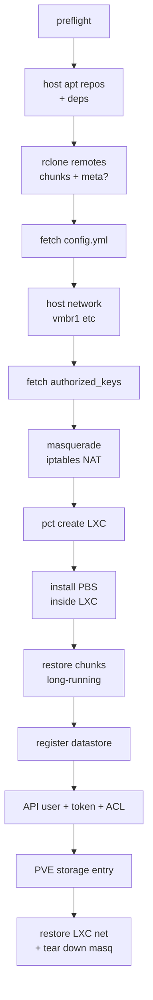

[English](README.md) | [한국어](README.ko.md)

# pbs-bootstrap

One-command DR for a [Proxmox Backup Server](https://www.proxmox.com/en/proxmox-backup-server) LXC. Bring a fresh PVE bare-metal install all the way to "PVE GUI can browse your backups" — no manual repo cloning, no env var export, no documentation grind. Interactive TUI by default.

```
┌────────────────────────────────────────────┐
│  pbs-bootstrap                             │
├────────────────────────────────────────────┤
│                                            │
│   Storage backend                          │
│   ( ) Backblaze B2                         │
│   (*) S3-compatible                        │
│                                            │
│           < OK >    < Cancel >             │
└────────────────────────────────────────────┘
```

## What you get

```mermaid
flowchart LR
    A[Fresh PVE<br/>bare-metal] --> B[Run bootstrap.sh]
    B --> C[Answer 5–8 TUI prompts]
    C --> D[Pipeline auto-runs:<br/>install · chunks · datastore · ACL · PVE storage]
    D --> E[PVE GUI sees<br/>backups, restore-ready]
    style E fill:#1e3a1e,stroke:#5b8c5a
```



Bootstrap stops at E. Restoring VMs from the backups is the operator's job, not this script's.

## Prerequisites

- Fresh **Proxmox VE** host. During installer ceremony, point `vmbr0` at your upstream router (consumer router / ISP modem) — **not** at the LAN firewall VM you're recovering.
- Browser access to PVE GUI (`https://<vmbr0-ip>:8006`). Web shell is enough; no laptop-side SSH key needed.
- A **chunks bucket** with your PBS datastore mirrored to it (B2 native or any S3-compatible — AWS, MinIO, Cloudflare R2, Wasabi, B2 via S3, etc).
- 2 application keys with **read access on the chunks bucket** — kept outside the homelab (password manager, encrypted USB, …).
- Somewhere to host `bootstrap-config.yml` and your `authorized_keys`. Options:
  - GitHub repo (raw URL, optional PAT for private)
  - HTTPS URL
  - Same B2/S3 (add 2 more keys with read on a **meta** bucket)
  - Local file (paste during DR)
  - GitHub user `.keys` endpoint (for SSH keys only)

That's it. No homelab repo, no terraform, no ansible — those are upstream of bootstrap.

## `bootstrap-config.yml` schema

```yaml
pbs:
  vmid:             200
  hostname:         pbs
  bridge:           vmbr1
  ip:               10.80.60.200
  gateway:          10.80.60.1
  datastore_name:   system-backup
  datastore_path:   /mnt/pbs_backup
  rootfs_size:      100              # GB
  rootfs_storage:   local            # PVE storage ID
  cores:            2
  memory_dedicated: 2048             # MB
  memory_swap:      1024             # MB

# Bridges to create on the host *in addition to* vmbr0
# (the PVE installer already owns vmbr0). Empty = skip.
host:
  bridges:
    - name:         vmbr1
      address:      10.80.60.254/24
      bridge_ports: none
      static_routes:
        - { subnet: 10.80.80.0/24, gateway: 10.80.60.1 }

storage:
  type:          b2                 # b2 | s3
  # endpoint:    https://...        # required when type=s3
  # region:      us-east-005        # required when type=s3
  chunks_bucket: my-pbs-chunks
```

## Pipeline



Times: prompts ~1 min · setup ~3 min · chunks restore ~10 min – many hours depending on bucket size and egress · finalization ~30 s.

## DR usage

1. **Install PVE bare-metal.** Hostname, vmbr0 IP/gw/DNS, root password. Pick a rootfs disk ≥ `pbs.rootfs_size + 30 GB`.
2. **Open PVE web shell** at `https://<vmbr0-ip>:8006` → node → Shell.
3. **Run bootstrap**:
   ```bash
   bash <(curl -sSL https://raw.githubusercontent.com/bigpie1367/pbs-bootstrap/main/bootstrap.sh)
   ```
4. Answer the prompts (chunks key, where the config lives, where the SSH keys live). Bootstrap then runs the pipeline.
5. **Verify**:
   ```bash
   pvesm status -storage pbs       # → active
   ```
   PVE GUI: `Datacenter → Storage → pbs` → browse backups.

From here it's your operator playbook — restore the firewall VM first, then the rest of the homelab, then re-arm steady-state automation. See [After bootstrap](#after-bootstrap).

## Non-interactive (CI, scripted re-run)

Set everything as env vars and bootstrap skips the TUI:

```bash
export PBS_STORAGE_TYPE=b2                        # or s3
# (s3 only)
# export PBS_STORAGE_ENDPOINT=https://s3.us-east-005.backblazeb2.com
# export PBS_STORAGE_REGION=us-east-005

export PBS_CHUNKS_KEY_ID=...  PBS_CHUNKS_KEY=...

export PBS_CONFIG=b2://my-pbs-meta/bootstrap-config.yml
export PBS_AUTH_KEYS=b2://my-pbs-meta/authorized_keys
# (only when PBS_CONFIG or PBS_AUTH_KEYS uses b2:// or s3://)
export PBS_META_KEY_ID=...    PBS_META_KEY=...

bash bootstrap.sh
```

Partial env works too — TUI prompts for whatever's missing.

### Source URI reference

| Form | Used for | Notes |
|---|---|---|
| `b2://<bucket>/<path>` | both | meta credentials required |
| `s3://<bucket>/<path>` | both | meta credentials required |
| `github:<owner>/<repo>/<branch>/<path>` | both | `PBS_<KIND>_GITHUB_PAT` if private |
| `https://...` | both | raw HTTP fetch |
| `/abs/path` or `./path` | both | local file |
| `<word>` (bare) | auth_keys | `https://github.com/<word>.keys` |
| `skip` | auth_keys | no SSH injection (web shell only) |

## Network shim — why and what it does

```mermaid
flowchart LR
    LXC["new PBS LXC<br/>10.80.60.200"]
    Host["Proxmox host<br/>vmbr1 10.80.60.254"]
    HostWAN["host vmbr0<br/>192.168.0.115"]
    Router["upstream router<br/>192.168.0.1"]
    Dead[("pfSense<br/>10.80.60.1 ❌")]
    B2[B2 / S3]

    LXC -.->|"normally"| Dead
    LXC -->|"during bootstrap<br/>gw override"| Host
    Host -->|"iptables MASQUERADE"| HostWAN
    HostWAN --> Router
    Router --> B2

    style Dead fill:#3a1e1e,stroke:#8c5a5a
```



Bootstrap can't trust the LAN firewall, so during the run it:
- Sets `ip_forward=1` on the host (saving previous value).
- Adds an `iptables -t nat MASQUERADE` rule for the LXC subnet via `vmbr0`.
- Creates the LXC with the host's bridge IP as its gateway + `1.1.1.1` as DNS.
- After chunks restore, restores the LXC's declared steady-state gateway with `pct set --net0` and tears the masquerade rule down.

All transparent — no env to toggle.

## Troubleshooting

<details><summary><b>Chunk restore is slow</b></summary>

B2 has class B (download) transaction caps. Check Backblaze dashboard. `--transfers 16 --checkers 32` in `lib/chunks-restore.sh` is tuned for typical home connections — bump for fatter uplinks.
</details>

<details><summary><b>LXC has no network during bootstrap</b></summary>

```bash
pct exec <vmid> -- ip -4 addr show
pct exec <vmid> -- ip -4 route show
pct exec <vmid> -- cat /etc/resolv.conf
```

Most common causes: bridge name drift (`bootstrap-config.yml` says `vmbr1` but it doesn't exist on the host), masquerade rule missing, DNS not injected.
</details>

<details><summary><b>`apt update` fails inside the LXC</b></summary>

Debian 12 LXCs often have broken IPv6 default routes. The script forces IPv4 (`/etc/apt/apt.conf.d/99force-ipv4`). If apt **still** fails, the LXC's egress is broken — see "LXC has no network".
</details>

<details><summary><b>Datastore not visible after bootstrap</b></summary>

```bash
pct exec <vmid> -- journalctl -u proxmox-backup-proxy --no-pager -n 50
pct exec <vmid> -- ls -la /etc/proxmox-backup/
pct exec <vmid> -- ls -la <datastore-path> | head
```

Common causes: `datastore.cfg` ownership wrong (must be `root:backup` `0640`), or chunks under datastore path still owned by `root` — re-run `chown -R backup:backup`.
</details>

<details><summary><b>PVE GUI shows backups but `pvesm list pbs` is empty</b></summary>

ACL/ownership issue on the PBS API side. Re-grant manually:

```bash
pct exec <vmid> -- proxmox-backup-manager acl update \
    /datastore/<name> DatastoreAdmin --auth-id <user>@pbs
pct exec <vmid> -- proxmox-backup-manager acl update \
    /datastore/<name> DatastoreAdmin --auth-id '<user>@pbs!<token>'
```
</details>

<details><summary><b>`pveam download` fails — template not found</b></summary>

The default `PBS_TEMPLATE` may have been replaced by a newer minor version on Proxmox's mirror.

```bash
pveam update
pveam available --section system | grep debian-12-standard
```

Re-run with `PBS_TEMPLATE=<new-name> bash bootstrap.sh`.
</details>

<details><summary><b>LXC already exists</b></summary>

Bootstrap refuses to overwrite an existing VMID. After a failed mid-run:

```bash
pct stop <vmid> --force 2>/dev/null
pct destroy <vmid> --force
```

Then re-run bootstrap. Resume-from-state isn't implemented.
</details>

## After bootstrap

Bootstrap stops once PVE can see PBS. From here the playbook is yours:

- Set the PBS GUI root password if you want PBS web UI: `pct exec <vmid> -- passwd root`.
- Restore VMs/CTs from PVE GUI in the order that fits your topology — typically LAN firewall first, then infrastructure (secrets, monitoring), then app guests.
- Re-arm steady-state automation: nightly B2 sync, prune / verify / GC schedules, notifications, monitoring.

This separation is deliberate. Bootstrap stays useful even for very different setups; your restore policy + ongoing operations stay in your own repo.

## License

MIT — see [LICENSE](LICENSE).
