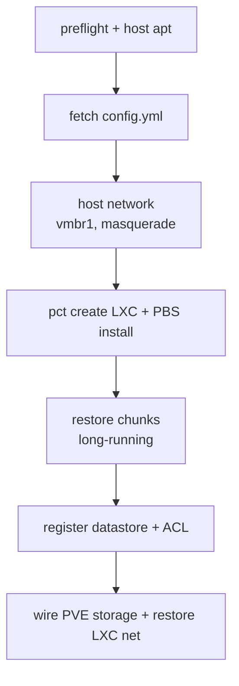

[English](README.md) | [한국어](README.ko.md)

# pbs-bootstrap

One-command DR for a [Proxmox Backup Server](https://www.proxmox.com/en/proxmox-backup-server) LXC: fresh PVE install → PVE GUI can browse your backups. Interactive TUI by default; env vars for automation.

## Quickstart

In the PVE web shell:

```bash
bash <(curl -sSL https://raw.githubusercontent.com/bigpie1367/pbs-bootstrap/main/bootstrap.sh)
```

Answer the prompts. Done when `pvesm status -storage pbs` is `active` and the PVE GUI's `pbs` storage shows your backup groups.

**Prereqs**: fresh PVE host (vmbr0 pointed at your upstream router, not the LAN firewall you're recovering); chunks bucket key (B2 native or any S3-compatible); somewhere to host `bootstrap-config.yml` + your SSH keys (GitHub repo, B2/S3, or local).

## Pipeline



## `bootstrap-config.yml`

```yaml
pbs:
  vmid:             200
  hostname:         pbs
  bridge:           vmbr1
  ip:               10.80.60.200
  gateway:          10.80.60.1
  datastore_name:   system-backup
  datastore_path:   /mnt/pbs_backup
  rootfs_size:      100
  rootfs_storage:   local
  cores:            2
  memory_dedicated: 2048
  memory_swap:      1024

host:
  bridges:                                # vmbr0 omitted — installer owns it
    - name:         vmbr1
      address:      10.80.60.254/24
      bridge_ports: none
      static_routes:
        - { subnet: 10.80.80.0/24, gateway: 10.80.60.1 }

storage:
  type:          b2                       # b2 | s3
  # endpoint:    https://...              # required when type=s3
  # region:      us-east-005              # required when type=s3
  chunks_bucket: my-pbs-chunks
```

## Non-interactive (CI / re-run)

```bash
export PBS_STORAGE_TYPE=b2
export PBS_CHUNKS_KEY_ID=... PBS_CHUNKS_KEY=...
export PBS_CONFIG=b2://my-pbs-meta/bootstrap-config.yml
export PBS_AUTH_KEYS=b2://my-pbs-meta/authorized_keys
export PBS_META_KEY_ID=...   PBS_META_KEY=...     # only if any source is b2:// or s3://

bash bootstrap.sh
```

Source URI forms (`PBS_CONFIG` and `PBS_AUTH_KEYS`):

| Form | Notes |
|---|---|
| `b2://<bucket>/<path>` · `s3://<bucket>/<path>` | meta credentials required |
| `github:<owner>/<repo>/<branch>/<path>` | `PBS_<KIND>_GITHUB_PAT` for private |
| `https://...` | raw HTTP fetch |
| `/abs/path` · `./path` | local file |
| `<user>` (bare word) | `auth_keys` only — `github.com/<user>.keys` |
| `skip` | `auth_keys` only — no SSH injection |

Partial env works too — TUI prompts for whatever's missing.

## Troubleshooting

<details><summary><b>Chunk restore is slow</b></summary>

B2 has class B (download) caps — check the dashboard. Bump `--transfers` / `--checkers` in `lib/chunks-restore.sh` for fatter uplinks.
</details>

<details><summary><b>LXC has no network during bootstrap</b></summary>

```bash
pct exec <vmid> -- ip -4 addr show
pct exec <vmid> -- ip -4 route show
pct exec <vmid> -- cat /etc/resolv.conf
```

Most common causes: bridge name drift, masquerade rule missing, DNS not injected.
</details>

<details><summary><b>Datastore not visible after bootstrap</b></summary>

`datastore.cfg` must be `root:backup 0640`; chunks must be `backup:backup`. Re-run `chown -R backup:backup <datastore-path>` if needed.
</details>

<details><summary><b>PVE GUI sees backups but <code>pvesm list pbs</code> is empty</b></summary>

```bash
pct exec <vmid> -- proxmox-backup-manager acl update \
    /datastore/<name> DatastoreAdmin --auth-id '<user>@pbs!<token>'
```
</details>

<details><summary><b><code>pveam download</code> fails — template not found</b></summary>

```bash
pveam available --section system | grep debian-12-standard
```

Re-run with `PBS_TEMPLATE=<new-name> bash bootstrap.sh`.
</details>

<details><summary><b>LXC already exists</b></summary>

Bootstrap is one-shot. `pct destroy <vmid> --force`, then retry.
</details>

## License

MIT — see [LICENSE](LICENSE).
